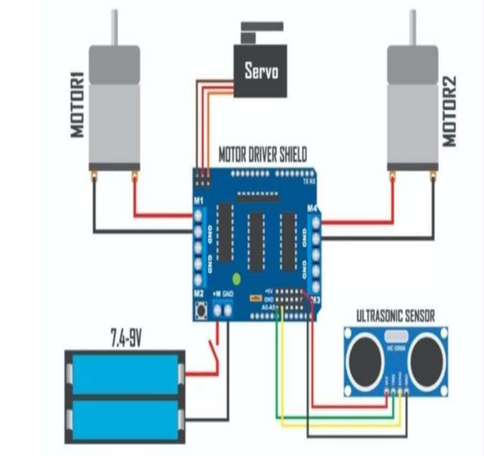

# Ultrasonic-Sensor-based-Robotics-Automation-using-ATMEGA328P

## 📝 Abstract
The Obstacle Avoiding Robot is designed to detect obstacles in its path and autonomously navigate around them without collision. It uses an **Arduino microcontroller** as its control unit and employs an **ultrasonic sensor** for distance detection. All hardware components used are inexpensive and widely available, making this robot easy to replicate.

---

## 📘 Introduction
An obstacle avoiding robot is an intelligent system capable of sensing its surroundings and identifying potential obstacles. With advancements in technology, robotics has become one of the fastest-growing fields in engineering. This project demonstrates an **Arduino-based autonomous robot** that uses ultrasonic sensing to avoid collisions effectively.

---

## 🔧 Components

| Component              | Description |
|------------------------|-----------|
| **Arduino Uno**        | Open-source microcontroller platform |
| **HC-SR04 Ultrasonic Sensor** | Measures distance using sound waves |
| **L293D Motor Driver Shield** | Controls two DC motors with speed & direction |
| **Servo Motor (SG90)** | Rotates sensor for left/right scanning |
| **Gear Motors (2x)**   | 3–12V DC motors with wheels |
| **Wheels (2x)**        | For smooth movement |
| **18650 Li-ion Battery** | 7.4V power supply (2 cells in series) |
| **Jumper Wires**       | For connections |
| **SPST Switch**        | Power ON/OFF |

---

## ⚙️ Working Principle

1. The ultrasonic sensor measures distance to obstacles in front.
2. If obstacle < **20 cm**, robot stops.
3. Servo rotates sensor: **left → center → right**.
4. Compares distances and turns toward the **clearer path**.
5. Motor driver controls movement: **forward, left, right, stop**.
6. Fully autonomous after code upload.

---

## 🚀 Circuit Diagram

---

## 📸 Photos

| Top View | Front View |
|--------|----------|
|  |  |
